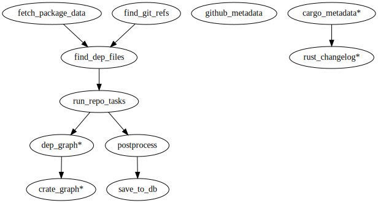

## find-package-rugaru

`find-package-rugaru` finds open source dependent packages in a git
repository and tests and flags suspicious open source packages (like
[the legendary rugaru](https://en.wikipedia.org/wiki/Rougarou)).

*NB: this project is in an alpha state and its APIs are not stable*


### Scanner

#### Installation

##### Requirements

* docker >=18.06.3
* python 3.8+ and pip
* [jq](https://stedolan.github.io/jq/)
* system packages to build psycopg2 (e.g. `build-essential libpq-dev` on debian buster)

After installing the above requirements:

```console
$ git clone https://github.com/mozilla-services/find-package-rugaru.git
$ cd find-package-rugaru
$ make install install-dev
$ docker pull mozilla/dependencyscan
$ docker pull postgres:12
```

#### Example Usage

1. start a local postgres database:

```console
$ make start-db
```

1. run one or more of the analysis scripts:

  * `./bin/analyze_package.sh <package_name> [<package_version>]`
  * `./bin/analyze_repo.sh <repository_url>`

```console
$ ./bin/analyze_package.sh lodash 4.17.15
analyzing lodash@4.17.15 saving intermediate results to /tmp/dep-obs.g7mNNBaLyVjR
...

2020-02-27 17:31:31,900 - fpr - INFO - pipeline finished
null
2020-02-27 17:31:32,403 - fpr - INFO - pipeline finished
$
```

or if you have more time to scan all git tags of the lodash repo:

```console
./bin/analyze_repo.sh https://github.com/lodash/lodash.git
analyzing tags of https://github.com/lodash/lodash.git saving intermediate results to /tmp/dep-obs.5pvSrfbn6Nox
...
```

Check the source of the scripts to find additional configuration
via environment variables.

1. Inspect the results in the local database:

```console
make db-shell
PGPASSWORD=postgres psql -U postgres -h localhost -p 5432 dependency_observatory
psql (12.2 (Ubuntu 12.2-2.pgdg18.04+1), server 12.1 (Debian 12.1-1.pgdg100+1))
Type "help" for help.

dependency_observatory=# \x on
Expanded display is on.
dependency_observatory=# SELECT * FROM package_versions WHERE name = 'lodash' ORDER BY inserted_at DESC;
-[ RECORD 1 ]-------------------------------------------------------
id          | 102
name        | lodash
version     | 4.17.15
language    | node
url         | https://registry.npmjs.org/lodash/-/lodash-4.17.15.tgz
repo_url    |
repo_commit |
inserted_at | 2020-02-26 17:12:47.373348
updated_at  |
```

#### Pipelines

The scripts are composed of components called pipelines (for lack of a
better term). For example `analyze_package.sh` will:

1. fetch information about the package from the npm registry
1. filter for git refs to clone and, if specified, the matching version
1. find dependency manifests or lockfiles (e.g. `package.json`) for each ref in a `debian:buster-slim` docker image
1. run `npm install --save=true`, `npm list --json`, and `npm audit --json` in the project root for each ref in a `node:10-buster-slim` docker image
1. postprocess and save the results to the local postgres database

Each individual pipeline can be run on its own. For example the
following `find_git_refs` pipeline used in `analyze_repo.sh` will find
git tags for the `mozilla-services/channelserver` project:

```console
$ echo '{"repo_url": "https://github.com/mozilla-services/channelserver"}' | docker run -i --rm -v /var/run/docker.sock:/var/run/docker.sock --name fpr-test mozilla/dependencyscan python fpr/run_pipeline.py -v find_git_refs
```

### Current Pipelines (from -h output)

```console
    crate_graph         Parses the output of the cargo metadata pipeline and
                        writes a .dot file of the dependencies to outfile
    dep_graph           Parses the output of the cargo metadata pipeline and
                        writes a .dot file of the dependencies to outfile
    fetch_package_data  Fetches additional data about a dependency.
    find_dep_files      Given a repo_url, clones the repo, lists git refs for
                        each tag
    find_git_refs       Given a repo_url, clones the repo, lists git refs for
                        each tag TODO: every Nth commit, or commit every time
                        interval. TODO: since and until args TODO: find
                        branches
    github_metadata     Given an input file with repo urls metadata output
                        fetches dependency and vulnerability metadata from
                        GitHub and an optional GitHub PAT and outputs them to
                        jsonl and optionally saves them to a local SQLite3 DB.
    postprocess         Post processes tasks for various outputs e.g.
                        flattening deps, filtering and extracting fields, etc.
                        Does not spin up containers or hit the network.
    run_repo_tasks      Runs tasks on a checked out git ref with dep. files
    rust_changelog      Given ordered cargo metadata output for git refs from
                        the same repo: 1. builds a dict of manifest filename
                        to cargo meta 2. groups the output into pairs (i.e. 1,
                        2, 3 -> (1, 2), (2, 3) in the provided order 3.
                        compares each pair as follows: a. compare each
                        manifest filename: 1) count new and removed
                        dependencies 2) new and removed authors and repo urls
                        TODO: output a diff of the updated dep code (need to
                        update the cargo metadata pipeline to pull these)
                        TODO: take audit output to show new and fixed Rust
                        vulns TODO: detect dep version changes
    save_to_db          Saves JSON lines to a postgres DB
```

See `bin/analyze_*` scripts and `Makefile` for example usage.

They feed into each other as follows (`*` indicates deprecated, removed or otherwise broken pipelines):



##### Pipeline API

*Note that this interface may be subject to change*


Each pipeline:

* reads and writes [JSON lines (basically newline delimited JSON objects)](https://jsonlines.org/)

* uses the args `-i,--infile` and `-o,--outfile` that respectively default to stdin and stdout to allow pipelining

* run as a python asyncio generator


See [the design doc](./design.md) for why this interface was chosen.


###### Adding a pipeline

1. copy an existing file from `fpr/pipelines/`
1. give it a new name in its `Pipeline` model declaration
1. add it to `fpr/pipelines/__init__.py`
